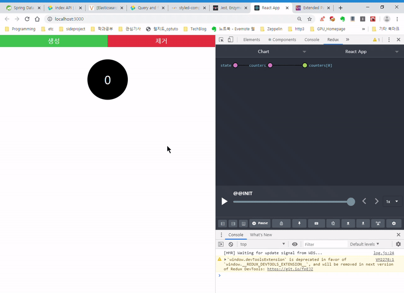

# References

- [\[react.js 공식 Docs\]](https://ko.reactjs.org/docs/handling-events.html) + [\[webpack\] 공식 Docs](https://webpack.js.org/guides/installation/), react native 소스코드 저장 및 문서화
- [react-training project](https://github.com/ReactTraining) 분석 및 예제 활용코드 작성
- reactjs에서 사용하는, javascript 몰랐던 문법 정리
- [리액트를 다루는 기술](https://book.naver.com/bookdb/book_detail.nhn?bid=15372757)공부한것 정리

## 학습 방법 :

1. [Reference](#References)학습하기
   - /src/Chapter/Readme.md 에 각 학습내용 정리
   - 에제 소스코드 작성 / 소스코드 분석하고 문서화
2. 1번에 기록한 내용 익혀서 블로그에 시리즈로 내용 정리

## 개념이 잘 정리된 링크

- [컴포넌트의 특성과 구성 메서드 정리](https://ko.reactjs.org/docs/react-component.html)
- [Training React Router & Docs](https://reacttraining.com/react-router/web/guides/quick-start)
- [velopert님의 리액트 라우터 소개](https://velopert.com/3417)

## Exercise

### 1. redux- Multi counter example (김종민 저 - 리액트를 다루는 기술)



### 더 공부할 내용

- 깃헙에서 책과 다른 구조의 설계방식 살펴보기
- Jest 연동 및 사용법
- ~~Redux 적용~~


## Error

### E01 _. webpack.config.js의 babel-loader가 jsx를 인식하지 못할 때_

[문제 해결 링크](https://codeday.me/ko/qa/20190306/7812.html)

Module build failed (from C:/Users/MKLee/git/Jclip-proto/node_modules/babel-loader/lib/index.js):

SyntaxError: C:\Users\MKLee\git\Jclip-proto\src\main\webapp\feapps\main\mainViewApp.js: Unexpected token (6:15)

```
 class MainViewApp extends React.Component{

     render(){

         return <div className="main">메인 페이지 테스트</div>

                 ^
     }
   }
```

**해결 : babel-preset-env 추가**
**Webpack사용하는 경우 웹팩 Rules > use케이스에 추가해도 된다.**

```
// .babelrc
{
    "presets":["@babel/preset-env","@babel/preset-react"]
}
```

---

## E02 _html파일에서 bundle file이 로드되었으나 정상적으로 렌더링을 수행하지 않을 때_

public/index.html, public/main.bundle.js가 존재하는 상황.  
public/index.html에 srcipt의 경로로, main.bundle.js(상대경로 같으므로) 입력해주었는데,  
**전송만 되고 컴포넌트를 로드하지 않는 상황이었음**

**해결 : main.bundle.js의 전체 경로인 /public/main.bundle.js 를 script의 src로 입력, 전송,로드가 모두 수행되었다. **

---

## E03 _Webpack 번들링 수행중, import 구문의 jsx파일이 not found_

**해결 : import Component from './path/compfile' ---> import Component from './path \*compfile.jsx;
확장자를 붙여주니 인식하였다..**

---


## E004 [상대경로 => 절대경로 문제] 

```javascript
import { App } from "../../../../../App"; //1
import { App } from "AppRoot/App"; //2
```

*컴포넌트  구조가 깊어질수록 상대경로가 지저분해지는 문제에 대해서 세 가지의 방법(두가지 사용가능) 을 찾아봤다.*

* 1._Webpack resolve.alias 수행 시, Module not found_ : **Deprecated**

[Webpack github issue /resolve.alias](https://github.com/webpack/webpack/issues/4160)깃헙 이슈 정리좀 해줬으면 좋겠다. 거의 Stackoverflow급... 질문답변 퍼레이드

상황 : import 구문에서, 지저분하고 알아보기 힘든 상대경로 대신, 절대경로 지정해주는 webpack의 resolve.alias 기능을 통해,

resolve.alias:{AppRoot:path.resolve(\_\_dirname,'path/to/comp/source')를 추가하고 빌드, Alias 사용한 import 구문에서 Module not found


* **2.같은 문제상황에서 resolve.alias보다 [좋은방법](https://webpack.js.org/configuration/resolve/#resolvemodules)을 알아냈다.**

```javascript

//...webpack...
module.exports={
...
resolve:{
        modules:[
            'node_modules',
            path.resolve(__dirname,'src/main/webapp/feapp/src/')
        ]
    },

...
}

```

```javascript
//..in module import...
import About from "components/contents/about.jsx";
//(실제경로:C:\Users\MKLee\git\Jclip-proto\src\main\webapp\feapp\src\components\contents\about.jsx)
```

webpack.config.js에 resolve.modulesDirectories 를 추가하고, 탐색할 디렉터리를 추가하면 된다.  
다수 운영체제에서 사용하는 path 환경변수와 비슷한 역할을 하는듯 하다.

좋은 방법인지는 더 고민해보자.

* **3. 시작 스크립트에 NODE_PATH(환경변수) 사용     | 출처 : 김종민 저 -리액트를 다루는 기술 P.364**

```javascript
//unix계열, CRA의 package.json에서
"start : "NODE_PATH=src react-script-start"
"build : "NODE_PATH=src react-script-build"

//windows, CRA의 package.json에서  npm install cross-env
"start : "cross-env NODE_PATH=src react-script-start"
"build : "cross-env NODE_PATH=src react-script-build"
```


---

## 나중엔 당연할 수 있지만 지금은 헷갈리는 것들

## javascript 문법

- [export](https://beomy.tistory.com/22) 파일이나 모듈 안의 함수,객체를 외부로 참조가능하도록 함. ES6에 정의된 API
- Map
- Arrow function
- filter
- sparse (...)

## 궁금한것 체크리스트

- [ ] 가상DOM과 브라우저 DOM 연관관계와 렌더링과정 설명하는 링크 찾고 요약하기
- [x] path.join과 path.resolve의 차이점
- [x] 컴포넌트에 render() 함수는 어떤 역할인지 정확하게 설명하기

* 컴포넌트에서 구현해야 하는 유일한 메서드
* state와 props를 활용해, **React Element, JSX, null, (Boolean,String,Number), 배열, Fragment**를 반환함
* 반환된 결과를 통해 렌더링을 수행합니다.
* [React Docs: render()](https://ko.reactjs.org/docs/react-component.html#render)

- [ ] import from xxx에서, 파일의 확장자 다 적는경우와 그렇지 않은 경우는 무언인지 (jsx 확장자를 기입하지 않았더니 module not found 뜨는 이유)
